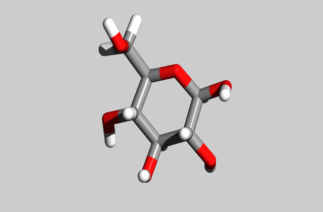

# xyz2pov

This implementation in Python and `numpy` converts xyz coordinate files into
povray scenes by

``` shell
python ./xyz2povray.py input.xyz
```

to yield `input.pov` and `input.ini`.  A subsequent run of `povray ./input.pov`
writes a single 800x600 px `input.png`.  With `povray ./input.ini` a sequence 
of 36 frames (640x420 px) yields a full rotation of the structure around
POVRay's x-axis, which can serve as template for further exploration, and to 
write an animated .gif e.g. on [ezgif](https://ezgif.com/)



All atoms starting from 1 (hydrogen, H) up to 96 (curium, Cm) are supported
by a color scheme close to the one used by Jmol.  If the interatomic
distance is less or equal the sum of the corresponding covalent radii
compiled by [Wikipedia](https://en.wikipedia.org/wiki/Covalent_radius), two
atoms are considered to be bound together; the model depicts them as
connected by a tube.  An atom "too far out" to bind with an other atom is
going to be displayed as sphere.

The camera is automatically directed to the molecule's center of mass and placed
at an appropriate distance. Two lights are placed relative to the camera
automatically.

