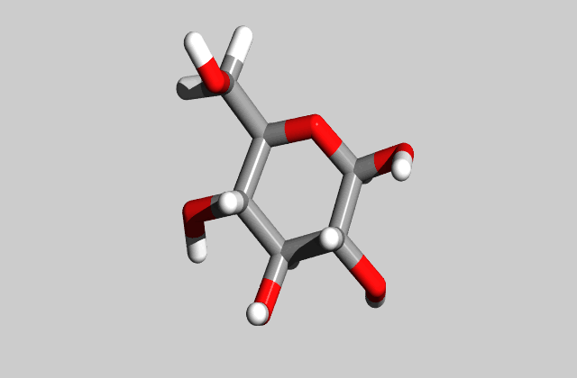

# xyz2pov

This implementation in Python and `numpy` converts a structure described by an
xyz coordinate file into POV-Ray scenes by

``` shell
xyz2povray.py input.xyz
```

with files `input.pov` and `input.ini`.  Subsequently, either

- run `povray ./input.pov` to write a single bitmap `input.png` (800 × 600 px),
  or
- run `povray ./input.ini` to generate a sequence of 36 frames (640 × 420 px) to
  rotate the structure around POV-Ray's x-axis.  This can be used to generate an
  animated gif (for instance on [ezgif](https://ezgif.com/)) as shown below for
  a cyclic form of glucose.



All atoms starting from atomic number 1 (hydrogen, H) up to 96 (curium, Cm) are
supported by a color scheme close to the one used by Jmol.  If the interatomic
distance is less or equal the sum of the corresponding covalent radii
compiled by [Wikipedia](https://en.wikipedia.org/wiki/Covalent_radius), two
atoms are considered to be bound together; the model depicts them as
connected by a tube.  An atom "too far out" to bind with an other atom is
going to be displayed as a sphere.

The camera is automatically directed to the molecule's center of mass and placed
at an appropriate distance. Two lights are placed relative to the camera
automatically.

## alternatives to `xyz2pov`

Alternative programs to describe a structure in the PovRay format include
[Jmol](https://jmol.sourceforge.net/)
(see [instructions](https://wiki.jmol.org/index.php/File_formats/Ray_Tracing)),
and [Avogadro](https://two.avogadro.cc/) (see
[instructions](https://two.avogadro.cc/docs/menus/file-menu.html#export)), or
CCDC's [Mercury](https://www.ccdc.cam.ac.uk/solutions/software/mercury/) (see
[instructions](https://www.ccdc.cam.ac.uk/discover/blog/how-to-make-videos-in-mercury/))
with a GUI.  Equally, [openbabel](https://github.com/openbabel/openbabel) allows
the generation from the CLI (see
[instructions](https://open-babel.readthedocs.io/en/latest/FileFormats/POV-Ray_input_format.html)).

At time of writing (July 2026, Linux Debian 14/forky with Python 3.13.14),
reserve about 30MB permanent memory for a virtual Python environment to
support the script `xyz2mol.py`.  Consider about 2MB in addition for the
script and its documentation.

## installation

Download the .zip archive, decompress it into a virtual Python
environment.  After its activation, run

``` shell
pip install .
```

to obtain `xyz2pov` as executable to the CLI.

## future compatibility with `numpy2`

For February 1st, 2024, `numpy2` was scheduled to be published as replacement
for `numpy` (see for instance
[here](https://pythonspeed.com/articles/numpy-2/)).
File `pyproject.toml` imposes a constraint on numy (>=1.24,<2.0) which
currently resolves to `numpy` 1.26.4.  Future versions of `xyz2pov` might
opt-in for the newer version of `numpy`.
